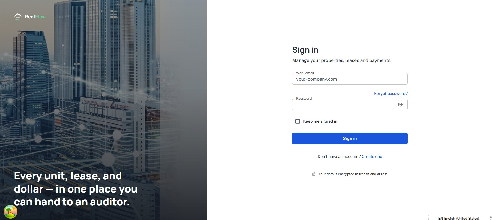
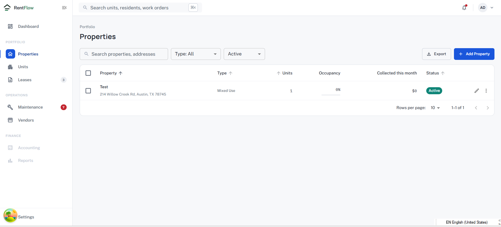
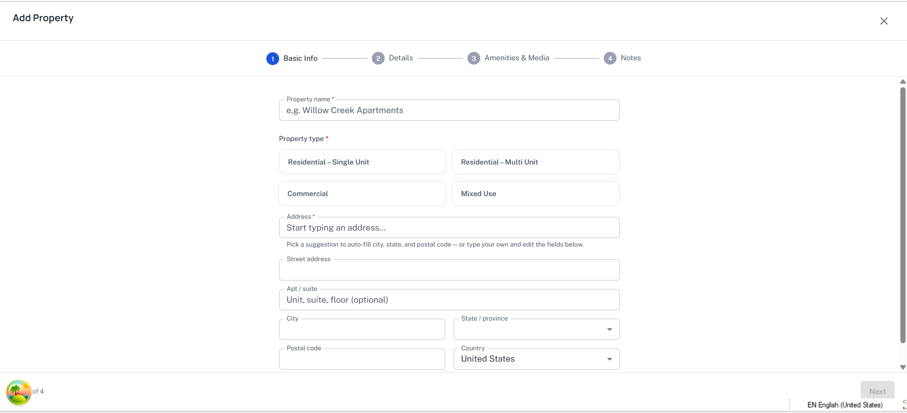
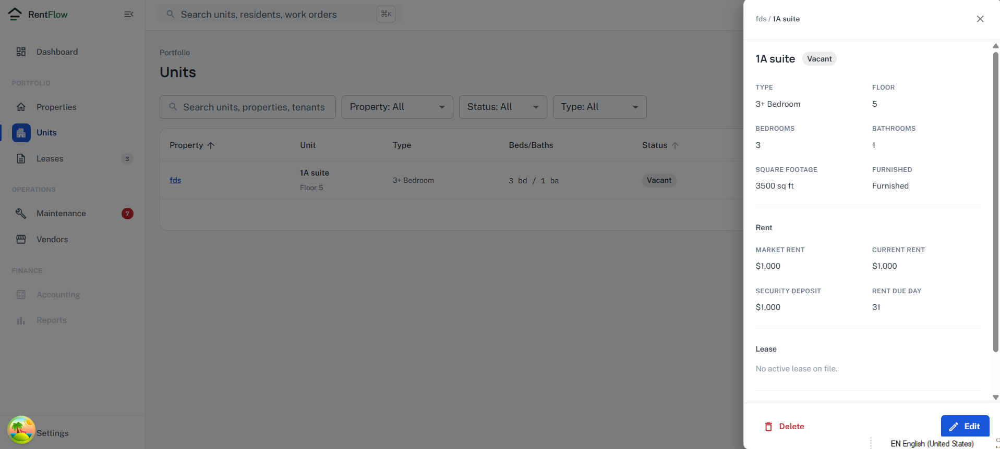
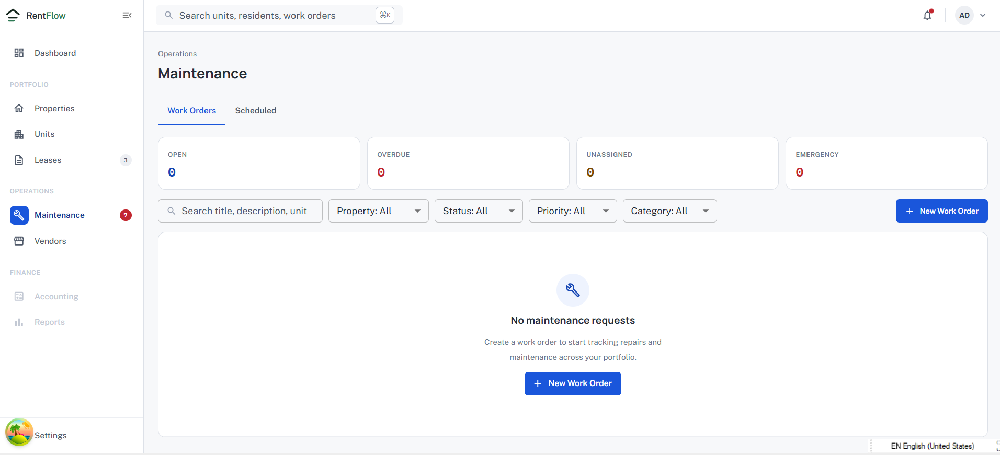

# PropertyManagement

A full-stack property management app: a Go API (chi, pgx, Redis) and a
React + TypeScript frontend (Vite, TanStack Query, Zustand, MUI).
The `properties` feature is implemented end-to-end (domain → service →
repository → HTTP → React) as a reference for adding new features.

See [`backend/cmd/api/README.md`](backend/cmd/api/README.md) for a
detailed walkthrough of the service bootstrap: the `main()`/`run()`
split, dependency wiring order, graceful shutdown, and version metadata.

## Screenshots

| Sign in | Properties |
| --- | --- |
|  |  |

| Add Property | Unit detail |
| --- | --- |
|  |  |

| Maintenance |
| --- |
|  |

## Stack

- **Backend**: Go 1.22+, [chi](https://github.com/go-chi/chi) router, PostgreSQL via
  [pgx](https://github.com/jackc/pgx), Redis (cache-aside reads + refresh-token revocation),
  JWT auth, [golang-migrate](https://github.com/golang-migrate/migrate) for schema migrations.
- **Frontend**: React 18 + TypeScript (strict), Vite, [MUI](https://mui.com/) (component library and theme,
  via `@mui/material` + Emotion), TanStack Query, Zustand, React Router, Vitest + React Testing Library.
- **Auth**: short-lived JWT access token held in memory on the client;
  a longer-lived JWT refresh token in an httpOnly, `SameSite=Strict`
  cookie. See [Auth model](#auth-model) below.
- **Infra**: Docker Compose for local dev (Postgres, Redis, API with hot
  reload via [air](https://github.com/air-verse/air), Vite dev server).

## Folder structure

```
backend/
  cmd/api/               entrypoint: loads config, wires dependencies, runs the server
  internal/domain/       core types + interfaces (Property, User, *Repository, *Service). No framework deps.
  internal/service/      business logic implementing the domain service interfaces
  internal/repository/
    postgres/             Postgres implementations of the domain repository interfaces
    rediscache/            Redis implementation of domain.Cache
  internal/transport/http/
    handlers/             HTTP handlers — decode request, call a service, write a response
    middleware/            request ID, structured logging, panic recovery, JWT auth
    dto/                    request/response JSON shapes (kept separate from domain types)
    response/               JSON envelope + centralized error → HTTP status mapping
    router.go, server.go   route table and http.Server wiring
  internal/config/        env-based config, validated at startup (fail fast)
  migrations/             versioned SQL migrations (golang-migrate)

frontend/
  src/app/                routing, providers (QueryClient, Router), root layout, pages
  src/api/                base fetch client: auth headers, error envelope parsing, 401 refresh-and-retry
  src/features/<name>/    one folder per feature domain
    api/                    typed HTTP calls + wire-to-domain-type mapping
    hooks/                  React Query hooks (queries + mutations)
    components/             feature UI, colocated *.test.tsx
    types/                  types matching the Go DTOs
    index.ts                the feature's public surface — only import from here, not from feature internals
  src/shared/              cross-feature reusable code only (error boundary, loading/error UI, env config)
```

This is a **hexagonal / clean architecture** on the backend: `internal/domain`
defines interfaces (`PropertyRepository`, `PropertyService`, `AuthService`,
`Cache`, ...) with zero knowledge of HTTP, SQL, or any framework.
`service` implements the `*Service` interfaces against the `*Repository`
interfaces; `repository/postgres` and `repository/rediscache` implement
those interfaces against real infrastructure; `transport/http` depends on
the domain interfaces, never on concrete service/repository types. Only
`cmd/api/main.go` is allowed to know about every layer at once (that's
where the dependency graph is wired).

The frontend is organized **by feature, not by technical layer** — a
`properties` change usually touches only `src/features/properties/`,
not five different top-level folders.

## Running locally

The frontend always runs natively (`npm run dev`) — it ships to S3 as a
static build, not a container, so there's no frontend Docker path to
run locally either. The backend has two options.

**Backend infra + API, via Docker Compose** (Postgres + Redis +
migrations + API with hot reload):

```bash
cp .env.example .env   # repo root — read by docker-compose.yml itself
docker compose up --build
```

- API: http://localhost:8080 (health: `/healthz`, readiness: `/readyz`)
- Every port (Postgres, Redis, API) binds to `127.0.0.1` only, not your
  whole network.
- Migrations run automatically via the one-shot `migrate` service before `api` starts.

**Backend only, natively** (useful for debugging — e.g. attaching a
real debugger, or running just the API against Compose's Postgres/Redis):

```bash
cd backend
cp .env.example .env   # then point DATABASE_URL/REDIS_ADDR at localhost if Postgres/Redis run elsewhere
make migrate-up        # requires the golang-migrate CLI: https://github.com/golang-migrate/migrate
make run
```

**Frontend**:

```bash
cd frontend
cp .env.example .env.local
npm install
npm run dev
```

- Frontend: http://localhost:5173

## Running tests

```bash
# Backend unit tests (table-driven, service layer — no external deps)
cd backend && make test

# Backend integration tests (real Postgres via testcontainers-go — requires Docker)
cd backend && make test-integration

# Backend lint (requires golangci-lint: https://golangci-lint.run/welcome/install/)
cd backend && make lint

# Frontend unit/component tests (Vitest + React Testing Library)
cd frontend && npm run test

# Frontend typecheck / lint
cd frontend && npm run typecheck && npm run lint
```

## Auth model

- `POST /api/v1/auth/register`, `/login` — create an account / sign in.
- `POST /api/v1/auth/refresh` — exchange the refresh cookie for a new access token. Rotates the refresh token (old one is revoked in Redis) and re-sets the cookie.
- `POST /api/v1/auth/logout` — revokes the current refresh token and clears the cookie.
- The **access token** is returned in the JSON body and kept in memory only (`src/features/auth/store/authStore.ts`, a Zustand store) — never in `localStorage`, so it isn't reachable by an XSS payload reading storage.
- The **refresh token** is set as an `httpOnly`, `Secure` (in production), `SameSite=Strict` cookie scoped to `/api/v1/auth`. Page JavaScript never sees it.
- On page load, `src/app/App.tsx` silently calls `/auth/refresh` once to re-establish a session from the cookie (so a reload doesn't force a re-login), then renders routes.
- `src/api/client.ts` transparently retries any request that gets a `401` by refreshing once and retrying; if the refresh also fails, it clears local auth state and surfaces the error.
- Protected routes (`/properties/*`) are gated by `src/app/layout/ProtectedRoute.tsx`; protected API routes are gated by `internal/transport/http/middleware/auth.go`'s `Authenticate` middleware (and `RequireRole` for role-gated ones).

## Adding a new feature end-to-end

Say you're adding **leases** (a lease belongs to a property and a tenant).
Follow the `properties` feature as the template, in this order:

### Backend

1. **Domain** (`internal/domain/lease.go`): define the `Lease` struct, `LeaseRepository` and `LeaseService` interfaces, and any input structs (`CreateLeaseInput`, ...). No framework imports.
2. **Migration** (`backend/migrations/`): `make migrate-create name=create_leases_table` (or use goose/whatever you swap in), then edit the generated `.up.sql`/`.down.sql`.
3. **Repository** (`internal/repository/postgres/lease_repository.go`): implement `domain.LeaseRepository` against pgx, following `property_repository.go` — map `pgx.ErrNoRows` to `domain.ErrNotFound`, wrap every error with `%w`.
4. **Service** (`internal/service/lease_service.go`): implement `domain.LeaseService`, validating input and calling the repository. Add `internal/service/lease_service_test.go` with a hand-written fake repository (see `property_service_test.go`) — no mocking framework needed.
5. **DTOs** (`internal/transport/http/dto/lease_dto.go`): request/response structs with `validate` tags, plus `ToDomain()` / `NewLeaseResponse()` mapping functions. Never expose domain types directly over HTTP.
6. **Handler** (`internal/transport/http/handlers/lease_handler.go`): decode+validate the request (`decodeAndValidate`), call the service, respond via `response.JSON`/`response.Error`. Every handler pulls its logger via `middleware.LoggerFromContext(r.Context())`.
7. **Router** (`internal/transport/http/router.go`): add the route(s) inside the authenticated group (or a new group if leases need different auth rules).
8. **Wire it up** in `cmd/api/main.go`: construct the repository, service, and handler, and pass the handler into `RouterConfig`.

### Frontend

1. **Types** (`src/features/leases/types/index.ts`): camelCase types mirroring the Go DTOs.
2. **API layer** (`src/features/leases/api/leasesApi.ts`): private snake_case "wire" types + mapping functions, exported functions that call `apiClient` and return the camelCase domain types (see `propertiesApi.ts`).
3. **Hooks** (`src/features/leases/hooks/useLeaseQueries.ts`): `useQuery`/`useMutation` wrappers around the API layer, with a `leaseKeys` query-key factory and cache invalidation on mutation `onSuccess` (see `usePropertyQueries.ts`).
4. **Components** (`src/features/leases/components/`): one component per file, wrapped in `<QueryState>` for the loading/error pattern, with a colocated `*.test.tsx`.
5. **Public surface** (`src/features/leases/index.ts`): re-export only what pages/other features should use.
6. **Wire it up**: add page(s) under `src/app/pages/`, add route(s) in `src/app/router.tsx` (wrap in `<ProtectedRoute>` if auth is required), add a nav link in `src/app/layout/RootLayout.tsx` if appropriate.

## Notes and assumptions

- **Module/package path**: the Go module is named `propertymanagement` (not a real `github.com/...` path) since no repository host was specified — rename it in `go.mod` and update imports before publishing.
- **SQL access**: repositories use hand-written pgx queries rather than sqlc-generated code, to avoid depending on the sqlc CLI being installed to regenerate code. Swapping to sqlc later only touches `internal/repository/postgres`.
- **Redis** is wired into both caching (property lookups, cache-aside with invalidation on write) and refresh-token revocation (so logout/rotation take effect immediately instead of waiting out the token's remaining lifetime). It's optional at the infrastructure level: if Redis is unreachable, the app logs a warning and keeps running — caching and immediate revocation degrade, but auth and CRUD keep working.
- **Integration tests** use testcontainers-go and need a working Docker daemon; they're excluded from `make test` (which only needs Go) and run via `make test-integration`.
